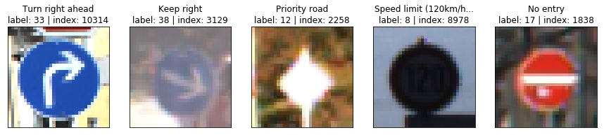

# **Traffic Sign Recognition** 

## **Build a Traffic Sign Recognition Project**

The goals / steps of this project are the following:
* Load the data set (see below for links to the project data set)
* Explore, summarize and visualize the data set
* Design, train and test a model architecture
* Use the model to make predictions on new images
* Analyze the softmax probabilities of the new images
* Summarize the results with a written report

## **Data Set Summary & Exploration**

### Step 1: Dataset Summary & Exploration

#### 1. Basic Summary of the Data Set Using Python, Numpy and/or Pandas

I used the pandas library to calculate summary statistics of the traffic
signs data set:

* The size of training set is  = 34799
* The size of the validation set is = 4410
* The size of test set is  = 12630
* The shape of a traffic sign image is = (32, 32, 3)
* The number of unique classes/labels in the data set is = 43

#### 2. Include an exploratory visualization of the dataset.

Here is an exploratory visualization of the data set.

Visualizations random set of images from the training set

Visualizations random set of images from the validation set

Visualizations random set of images from the test set

### Step 2: Design and Test a Model Architecture

#### 1. Pre-process the Data Set (normalization, grayscale)

In general, neural networks results in higher accuracy classification with grayscale images than with RGB images. Further neural networks work better if the input (feature) distributions have mean zero. A suggested way to have that normalization was to operate on each pixel by applying: `(pixel - 128)/128.`

Therefore I decided to use the following techniques for preprocessing:

- Convert the images to gray scale using opencv
- Normalize/Transform the pixel values to the range [-1, 1] by subtracting 128 and then divide it by 128.

Image after preprocessing

I got good results without data augmentation (e.g. shifting, rotatation images, changing colors)  so I decided not to use this I technique.

○ shifting images
○ rotating images
changing colors

#### 2. Model architecture

I decided to use [LeNet](http://yann.lecun.com/exdb/lenet/) model architecture provided by [Udacity](https://github.com/udacity/CarND-LeNet-Lab). This model was proved to work well in the recognition hand and print written character. It could be a good fit for the traffic sign classification (http://yann.lecun.com/exdb/publis/pdf/sermanet-ijcnn-11.pdf).
At first I modified the input depth to 3 (3 RGB channels) and set the output classes to 43 (43 labels in the traffic sign data set). I could not have more than 90% accuracy with my current dataset and 5 epochs.
Increasing the epochs and making the convolution layer deeper, I got some performance issues on my MacBook without Nvidia GPU. I decided to create an AWS Instance and train my model here. Running my model on the AWS Instance (~6 sec) was about 45 times faster than on my MacBook without Nvidia GPU (~280sec)!

After modifying the standard model work with color pictures, I could not have more than 90% accuracy with my current dataset and 15 epochs. To improve that, start making the first two convolution layer deeper, and then increase the size of the fully-connected layers as well. With these modifications, I got just above 90% accuracy. To go further, I added two dropout layers with 0.7 keep probability and increased the training epochs to 40. The final model is described as follows:

My final model consisted of the following layers:

|Layer | Description|Output|
|------|------------|------|
|Input | RGB image| 32x32x3|
|Convolutional Layer 1 | 1x1 strides, valid padding | 28x28x16|
|RELU| | |
|Max Pool| 2x2 | 14x14x16|
|Convolutional Layer 2 | 1x1 strides, valid padding | 10x10x64|
|RELU| | |
|Max Pool | 2x2 | 5x5x64|
|Fatten| To connect to fully-connected layers |
|Fully-connected Layer 1| | 1600|
|RELU| | |
|Dropout| 0.5 keep probability ||
|Fully-connected Layer 2| | 480
|RELU| | |
|Dropout| 0.5 keep probability||
|Fully-connected Layer 3| | 43
 

#### 3. Train, Validate and Test the Model

To train the model, I started iterative increasing the epochs 10, 20, 30, 50. But increasing the epochs higher than 20 did not bring signifigant improvements, see the network accurary by epoch screenshots.
Additionally I made the cnn deeper. At first factor 2 and finally 4 compared to the model architecture provided by [Udacity](https://github.com/udacity/CarND-LeNet-Lab).
With this approach I got very good results more than 96% validation set accurary and nearly 100% training set accurary. The test set accuracy was higher than 95 %.
To prevent overfitting and stabilze the network, I added the dropout regularization method (keep_prob = 0.5) to the 4 and 5th layer for the training phase.

I used the  [Adam](http://sebastianruder.com/optimizing-gradient-descent/index.html#adam) optimizer. Playing with increasing and decreasing the learning rate 0.001 and the batch size 128, I did not get better results.

My final model results were:
* training set accuracy of 100.0 %
* validation set accuracy of 97,2 %
* test set accuracy of 96,1 %

### Test a Model on New Images

#### 1. Choose five German traffic signs found on the web and provide them in the report. For each image, discuss what quality or qualities might be difficult to classify.

Here are five German traffic signs that I found on the web:

![alt text][image4] ![alt text][image5] ![alt text][image6] 
![alt text][image7] ![alt text][image8]

The first image might be difficult to classify because ...

#### 2. Discuss the model's predictions on these new traffic signs and compare the results to predicting on the test set. At a minimum, discuss what the predictions were, the accuracy on these new predictions, and compare the accuracy to the accuracy on the test set (OPTIONAL: Discuss the results in more detail as described in the "Stand Out Suggestions" part of the rubric).

Here are the results of the prediction:

| Image			        |     Prediction	        					| 
|:---------------------:|:---------------------------------------------:| 
| Stop Sign      		| Stop sign   									| 
| U-turn     			| U-turn 										|
| Yield					| Yield											|
| 100 km/h	      		| Bumpy Road					 				|
| Slippery Road			| Slippery Road      							|

The model was able to correctly guess 4 of the 5 traffic signs, which gives an accuracy of 80%. This compares favorably to the accuracy on the test set of ...

#### 3. Describe how certain the model is when predicting on each of the five new images by looking at the softmax probabilities for each prediction. Provide the top 5 softmax probabilities for each image along with the sign type of each probability. (OPTIONAL: as described in the "Stand Out Suggestions" part of the rubric, visualizations can also be provided such as bar charts)

The code for making predictions on my final model is located in the 11th cell of the Ipython notebook.

For the first image, the model is relatively sure that this is a stop sign (probability of 0.6), and the image does contain a stop sign. The top five soft max probabilities were

| Probability         	|     Prediction	        					| 
|:---------------------:|:---------------------------------------------:| 
| .60         			| Stop sign   									| 
| .20     				| U-turn 										|
| .05					| Yield											|
| .04	      			| Bumpy Road					 				|
| .01				    | Slippery Road      							|

For the second image ... 

### (Optional) Visualizing the Neural Network (See Step 4 of the Ipython notebook for more details)
#### 1. Discuss the visual output of your trained network's feature maps. What characteristics did the neural network use to make classifications?

