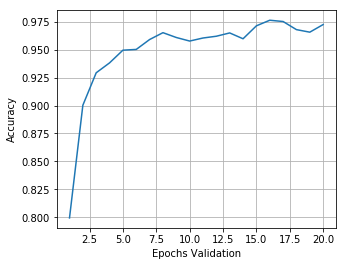
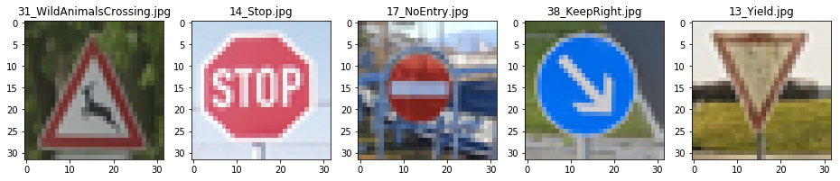
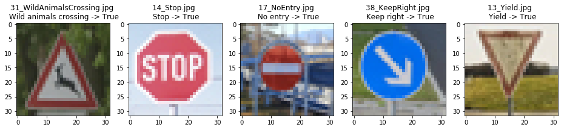
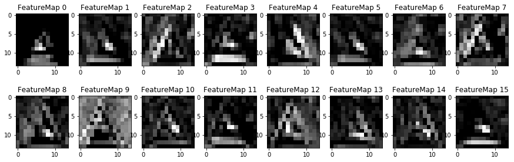

# **Traffic Sign Recognition** 

## **Build a Traffic Sign Recognition Project**

The goals / steps of this project are the following:
* Load the data set (see below for links to the project data set)
* Explore, summarize and visualize the data set
* Design, train and test a model architecture
* Use the model to make predictions on new images
* Analyze the softmax probabilities of the new images
* Summarize the results with a written report

## **Data Set Summary & Exploration**

### Step 1: Dataset Summary & Exploration

#### 1. Basic Summary of the Data Set Using Python, Numpy and/or Pandas

I used the pandas library to calculate summary statistics of the traffic
signs data set:

* The size of training set is  = 34799
* The size of the validation set is = 4410
* The size of test set is  = 12630
* The shape of a traffic sign image is = (32, 32, 3)
* The number of unique classes/labels in the data set is = 43

#### 2. Include an exploratory visualization of the dataset.

Here is an exploratory visualization of the data set.

Visualizations random set of images from the training set

Visualizations random set of images from the validation set

Visualizations random set of images from the test set

### Step 2: Design and Test a Model Architecture

#### 1. Pre-process the Data Set (normalization, grayscale)

In general, neural networks results in higher accuracy classification with grayscale images than with RGB images. Further neural networks work better if the input (feature) distributions have mean zero. A suggested way to have that normalization was to operate on each pixel by applying: `(pixel - 128)/128.`

Therefore I decided to use the following techniques for preprocessing:

- Convert the images to gray scale using opencv
- Normalize/Transform the pixel values to the range [-1, 1] by subtracting 128 and then divide it by 128.

Image after preprocessing

I got good results without data augmentation (e.g. shifting, rotatation images, changing colors)  so I decided not to use this I technique.

#### 2. Model architecture

I decided to use [LeNet](http://yann.lecun.com/exdb/lenet/) model architecture provided by [Udacity](https://github.com/udacity/CarND-LeNet-Lab). This model was proved to work well in the recognition hand and print written character. It could be a good fit for the traffic sign classification (http://yann.lecun.com/exdb/publis/pdf/sermanet-ijcnn-11.pdf).
At first I modified the input depth to 3 (3 RGB channels) and set the output classes to 43 (43 labels in the traffic sign data set). I could not have more than 90% accuracy with my current dataset and 5 epochs.
Increasing the epochs and making the convolution layer deeper, I got some performance issues on my MacBook without Nvidia GPU. I decided to create an AWS Instance (g2.2xlarge) and train my model on the AWS server. I was suprised, that running my model on the AWS Instance (~6 sec) is so much faster than on my MacBook without Nvidia GPU (~280sec).

My final model consisted of the following layers:

|Layer | Description|Output|
|------|------------|------|
|Input | Grayscale/RGB image | 32x32x3|
|Convolutional Layer 1 | 1x1 strides, valid padding | 28x28x16|
|RELU| | |
|Max Pool| 2x2 | 14x14x16|
|Convolutional Layer 2 | 1x1 strides, valid padding | 10x10x64|
|RELU| | |
|Max Pool | 2x2 | 5x5x64|
|Fatten| To connect to fully-connected layers |
|Fully-connected Layer 1| | 1600|
|RELU| | |
|Dropout| 0.5 keep probability ||
|Fully-connected Layer 2| | 480
|RELU| | |
|Dropout| 0.5 keep probability||
|Fully-connected Layer 3| | 43
 

#### 3. Train, Validate and Test the Model

To train the model, I started iterative increasing the epochs 10, 20, 30, 50. I detected increasing the epochs higher than 20 did not bring signifigant improvements, see the network accurary by epoch screenshots. So I've decided to concentrate on 20 epochs.

Additionally I made the cnn deeper. At first by factor 2 and finally 4 compared to the model architecture provided by [Udacity](https://github.com/udacity/CarND-LeNet-Lab). This has also bring so improvements, in average about 2 %.

With this approach I got very good results more than 97% validation set accuracy and nearly 100% training set accuracy. The test set accuracy was higher than 96 %.

To prevent overfitting and stabilze the network, I added the dropout regularization method (keep_prob = 0.5) to the 4 and 5th layer for the training phase.

I used the  [Adam](http://sebastianruder.com/optimizing-gradient-descent/index.html#adam) optimizer. Playing with increasing and decreasing the learning rate 0.001 and the batch size 128, I did not get better results. Some of the results were much worse, eg. learning rate 0.01.

My final model results were:
* training set accuracy of 100.0 %
* validation set accuracy of 97,2 %
* test set accuracy of 96,1 %

### Step 3: Test a Model on New Images

Here are five German traffic signs that I found on the web.

I labeled the images with a prefix in the filename, eg. 13_Yield.png.
The labels are numbers, from the [.csv file](signnames.csv) containing the mapping between the labels and a text name of the image.

The first image (Wild animal crossing) might be difficult to classify because it's not clearly identifiable. The other signs are clearly visible. I was very curious to see how my model works on it.

The same preprocessing is applied to them:

3_result_myimages_dataset.png

Here are the results of the prediction:

The model was able to correctly guess 5 of the 5 traffic signs, which gives an accuracy of 100%. This is better than the accuracy on the test set of 96,1 %. I was suprised,  that every sign was 100% detected.
Probably the image quality is too good.

Here are the top five softmax probabilities for them and their name values:

Image: mytestimages/31_WildAnimalsCrossing.jpg
Probabilities:
**1.000 : 31 Wild animals crossing**
0.000 : 21 Double curve
0.000 : 25 Road work
0.000 : 29 Bicycles crossing
0.000 : 30 Beware of ice/snow

Image: mytestimages/31_WildAnimalsCrossing.jpg
- **1.000 : 31 Wild animals crossing**
- 0.000 : 21 Double curve
- 0.000 : 25 Road work
- 0.000 : 29 Bicycles crossing
- 0.000 : 30 Beware of ice/snow

Image: mytestimages/14_Stop.jpg
- **1.000 : 14 Stop**
- 0.000 : 34 Turn left ahead
- 0.000 : 17 No entry
- 0.000 : 38 Keep right
- 0.000 : 33 Turn right ahead

Image: mytestimages/17_NoEntry.jpg
- **1.000 : 17 No entry**
- 0.000 : 40 Roundabout mandatory
- 0.000 : 9 No passing
- 0.000 : 12 Priority road
- 0.000 : 34 Turn left ahead

Image: mytestimages/38_KeepRight.jpg
- **1.000 : 38 Keep right**
- 0.000 : 18 General caution
- 0.000 : 20 Dangerous curve to the right
- 0.000 : 25 Road work
- 0.000 : 12 Priority road

Image: mytestimages/13_Yield.jpg
- **1.000 : 13 Yield**
- 0.000 : 12 Priority road
- 0.000 : 15 No vehicles
- 0.000 : 41 End of no passing
- 0.000 : 38 Keep right

### Step 4 (Optional): Visualize the Neural Network's State with Test Images
This was an optional step, but I tried it for the first layer and for the second layer (with some errors, warnings).

